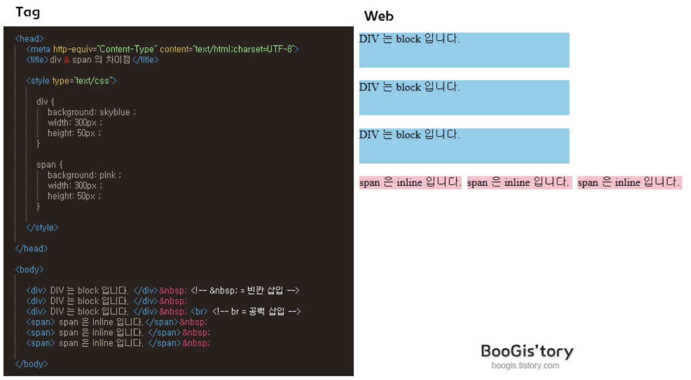

## div와 span 차이
- div
	- div는 display:block 과 같은 성질을 가진다.
	- 블럭을 쌓듯 위로 포개지는 성격을 가진다.
- span
	- span은 display: inline과 같은 성질을 가진다.
	- 옆으로 다닥다닥 붙는 성질이 있으며 영역을 그 안에 들어가는 크기만큼으로 제한한다.

출처 : http://boogis.tistory.com/48
