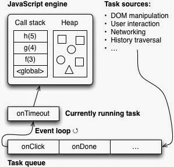

## 자바스크립트와 이벤트 루프

자바스크립트로 우리는 많은 일을 할 수 있다. 웹 브라우저에서는 애니매이션 효과를 보여주면서 마우스 입력을 받기도 하고, nodejs 서버에서는 동시에 여러개의 http 요청을 처리하기도 한다.

여기서 의문점이 하나 생긴다. 자바스크립트는 스레드가 하나인데 어떻게 이것이 가능한가????

이 의문점을 해결해 줄 개념이 바로 **이벤트루프** 이다. 자바스크립트는 이벤트루프를 이용, 비동기 방식으로 동시성을 지원한다. 나와 같은 동기 방식의 언어만 사용하다가 자바스크립트로 넘어온 사람들은 이벤트 루프가 어떻게 동작하는지 이해하기 어려웠을 것이다. ( 아님 말고 )

### 자바스크립트 자체에는 이벤트 루프가 없다.

자바스크립트 V8 엔진은 단일 호출 스택을 사용하며, 요청이 들어올 떄 마다 해당 요철을 순차적으로 호출 스택에 담아 처리한다.

그렇다면 비동기 요청 및 동시성에 대한 처리는 누가하는 것인가? 바로 자바스크립트 엔진이 돌아가는 환경, 브라우저나 nodejs가 담당한다.

위의 그림과 같이 실제 우리가 비동기 호출을 위해 사용하는 setTimeout, setInterval, httprequest와 같은 함수들은 자바스크립트 엔진이 아닌 web api 영역에 따로 정의가 되어있다. 또한 태스크 큐와 이벤트 루프도 자바스크립트 엔진 외부에 구현되어 있다.

### Nodejs 환경

nodejs 환경도 살펴보자. 잘 알려진 대로 nodejs는 비동기 IO를 지원하기 위해 libuv 라이브러리를 사용하며 이 libuv가 이벤트 루프를 제공한다.

자바스크립트 엔진은 비동기 작업을 위해 nodejs의 api를 호출하며, 이때 넘겨진 callback function은 libuv의 이벤트 루프를 통해 스케줄 되고 실행된다.

자바스크립트가 ''단일 스레드 기반의 언어''라는 말은 자바스크립트 엔진이 단일 호출 스택을 사용한다는 관점에서만 사실이다. 실제 자바스크립트가 구동되는 환경에서는 여러개의 스레드가 사용되며, 이러한 구동 환경과 자바스크립트 엔진이 상호 작용하기 위해 사용되는 장치가 바로 **이벤트 루프** 이다.

### 기본 동작

1. 자바스크립트의 호출 스택에 3가지 테스크가 걸려있다.
2. 코드를 실행하는 중 비동기 api가 호출되었다 ( Ex. setInterval )
3. 비동기 api에 넘겨준 callback은 태스크 큐로 넘어간다.
4. 자바스크립트의 호출 스택이 다 빌때 까지 이벤트 루프는 대기하며 반복적으로 비어있는지 확인한다.
5. 호출스택이 다 비었으면 이벤트루프는 테스크 큐에 있는 callback을 하나씩 꺼내서 실행시킨다.
6. 위의 과정들을 반복한다.

---

출처 - https://github.com/nhnent/fe.javascript/wiki/June-13-June-17,-2016
