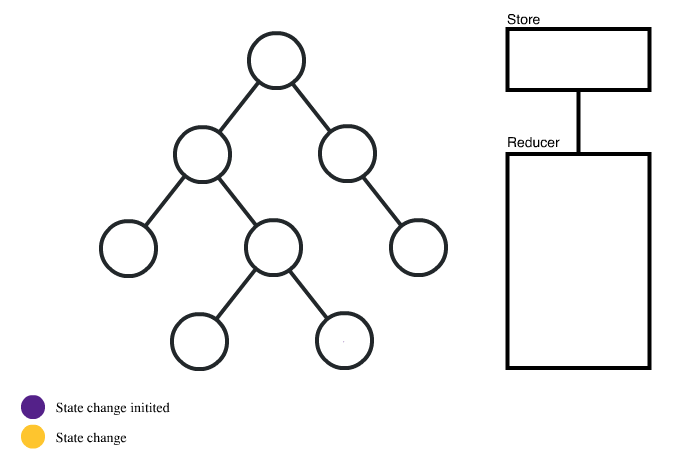

### 2017-12-4

## redux에 대한 생각

redux는 flux 구조를 바탕으로 만든 라이브러리로, react app 전체의 state 관리를 도와준다. 여기서 주의해야 할 점은 redux의 state는 react의 state와 전혀다르다는 점이다

react의 state는 컴포넌트 내부에서 조작되며, 다른 컴포넌트가 그 state를 조작하기 위해서는 그 컴포넌트가 전달해준 callback function으로만 가능하다. 그리고 컴포넌트 트리의 구조가 복잡해 지면 어떤 한 컴포넌트에서 발생한 이벤트에따라 다른 컴포넌트의 값을 변경하려면 꽤 복잡한 과정을 거쳐야 한다.

redux의 state는 앱 전체의 state이다.  redux의 state 변경 과정은 이러하다.
- 일단 redux는 모든 state를 하나의 store에 저장시키고 있다. 정말 간단하게 생각한다면 하나의 데이터베이스라고 생각할 수 있겠다. 그리고 그 데이터베이스에있는 데이터를 어디선가 변경시키면 그 데이터를 사용하고 있던 다른 곳에서 변경사항을 받아서 업데이트 하는 방식이다.
- 큰 흐름으로 보자면 어떤 컴포넌트에서 action을 발생시키면 그 action을 reducer에서 받아서 action에 따라 state를 변경하고, 그것을 store에 전달하면 store에 새로운 state가 저장된다. 그리고 변경된 state가 그 state를 사용하고 있던 다른 컴포넌트들에게 전달된다.

즉 react에서의 state는 각 컴포넌트가 가지고 있었다면, redux는 그 state를 한군데에 모아놓고 관리한다고 생각할 수 있겠다.

한군데에 모아놓은 redux라는 개념이 리액트의 구조에 도움이 될까??
- 기존의 react의 state를 통해 부모를 타고 올라갔다가 내려오는 등의 데이터 교환 방식의 불편함을 없애고, react자체를 진짜 뷰에만 집중할 수 있도록 한 점에 있어서는 정말 좋고 도움이 된다고 생각한다.
- 하지만 store의 크기가 점점 커진다고 생각하면 state중 하나의 값을 변경할 때 마다 큰 데이터가 왔다갔다해서 성능이 떨어지지 않을까??
	- 참고링크
	- [performance with huge size store](https://www.reddit.com/r/reactjs/comments/41wdqn/redux_performance_issues_with_a_large_state_object/)
	- [Common Redux misconception](https://twitter.com/dan_abramov/status/684074628227182592)

- 이 링크들을 보니 store 내부의 state에 대해 깊은 복사를 매우 많이 행하지 않는다면 대부분 얕은복사 즉 referencing을 하기 때문에 성능에 문제가 되지 않는다고 한다.
- 하지만 실 사용하는 입장이 되면 이것도 실제로 측정을 해봐야 할 부분인 것 같다.

## 이미지 출처 : [노마드 코더](https://academy.nomadcoders.co/courses)