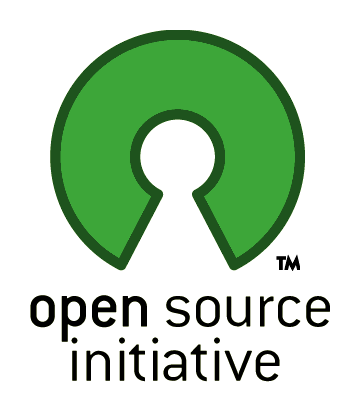
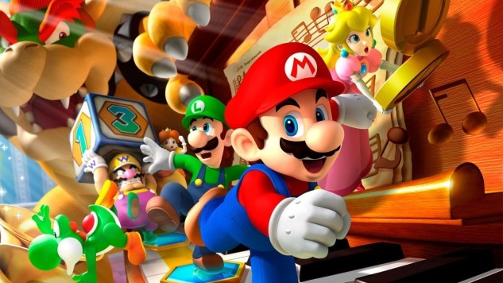

# 오픈소스를 분석하며 게임을 만들어보고 느낀점

----------

### 서론
이전에 오픈소스로 게임만드는 과정을 글로 쓴것들이 있었다. 그것들을 진행해 보면서 공통적으로 느꼈던점, 배운점을 회고해보고 앞으로 내가 어떤 생각을 가져야 할지 정리해보려고 한다.

글로 쓴 내용은 2개 뿐이지만, 사실 자잘하게 만든 것들도 몇개 더 있었다. 하지만 너무 두서없이 만든 경향이 있고, 내가 전부 만든게 아닌 다른 분과 만든 부분도 있어서 글로 정리하기가 어려웠다 ㅠㅠㅠ 다음부터는 하나 끝나고 나면 꼭 정리하는 시간을 가져야지 ㅠㅠ

### 왜 게임을 만들기 시작했는가?

나는 2017년 6월쯤에 한창 고민에 빠져있었다. 이제 학교에서 하는 것들은 잘 하는거 같고, 재미도 있다. 그런데 더 잘하려면 뭘해야하는가? 라는 생각을 했고 이리저리 커뮤니티도 많이 다니고, 강연도 들으면서 뭘 해야할까 찾아다녔다. 그리고 마이다스아이티의 해커톤도 다녀와봤는데 학교레벨 정도의 것은 잘하나, 아직 개발을 혼자서 많이 해보지는 않은 느낌이라는 생각이 들었다.

그 시즌에 온라인 멘토링 관련 글을 봤고, 멘토링 가이드 글을 읽어보았다. 멘토링의 내용은 자신이 만들고 싶은 것을 과제로 정하고 그것에 대한 분석을 하고, 관련된 오픈소스를 리서치하고, 그 소스를 개선 및 재조립하여 만들어가면 멘토분들이 도와주는 내용이었다. 그리고 만들고 싶은게 없거나 아직 만들기엔 실력이 부족하다고 느껴지면 작은 게임을 만들어보라는 내용이었다.

사실 맨 처음에는 나름 컴공이고 여러가지 만들어봤다고 생각해서 규모가 약간 크고 아직 배우지 못한 내용인 프로그램을 생각했었다. 그러나 이걸 만드려고 하니 어떻게 돌아가야 할지는 머리속에 그려지지만 디테일하게 어떻게 접근해야할지도 모르겠고 어떤 부분을 공부해 나가야 할지도 모르겠어서 흐지부지 되버리고 말았다.

그래서 차라리 테트리스 게임을 만들어 보자고 생각했다. 왜냐면 이전부터 만들어보고 싶었고, 많은 사람이 많이 만들어본 것이기 때문에 참고할만한 오픈 소스가 많고, 생각해보니 작은 게임조차도 콘솔 이외의 것으로 처음부터 끝까지 만들어본적이 없었기 때문이다.

그리고 그 당시 서버에대한 관심이 있었고, 뷰를 만드려면 html,css,js로 만드는 편이 접근이 쉽다고 생각했고, js로 서버를 만들수 있는 nodejs가 있었기 때문에 자바스크립트 강의를 빠르게 들으면서 게임을 만들기 시작했다.

### 게임을 만들어가는 공통적인 과정은 무엇인가?

몇가지 작은 게임들을 멘토링 글을 보면서, 나 나름 경험하면서 공통적인 과정이 있었다.

1. 자신이 만들고자 하는 게임과 유사한 게임을 검색하고 '내가 이해하기 쉬운 규모의 것을 찾기'
	- 게임을 검색하면 엄청나게 많은 검색 결과가 나온다. 그리고 그것들을 하나하나 분석하면서 어떤것을 가져올지 분석하는 것은 미친짓이라는 생각이 들었다.
	- 그래서 몇가지 기준을 생각하고 기준과 가장 근접한 소스를 여러개 찾아서 데모를 돌려보는 방식으로 했다.
		- 첫번째로 내가 이해하기 어려운 너무 큰 규모의 것은 배제한다.
		- 두번째로 데모가 있는 것은 우선순위로 둔다. 그래야 실제 돌아가는 게임인지, 기능이 제대로 구현되었는지 알기 쉽다.
		- 세번째로 객체화 모듈화가 잘 되어있는지
		- 네번째로 readme가 잘 적혀있는지. readme가 잘 적혀있고 사진이 있어야 더 눈이가고 이해도 쉬웠다. 나중에 나도 제대로 프로그램을 만들면 이미지와 함께 readme를 잘 적는 습관을 들일것이다.
2. 다른 사람의 소스를 이해하기
	- 위와같이 후보들을 추린다음 그중 하나를 선택해서 메소드 하나하나 테스트해보고 분석하기 시작했다.
	- 다른 사람의 소스를 이해한다는 것이 처음에는 쉽지 않은 일이었다. 하지만 모듈화 객체화가 잘 되어있는 소스코드는 이해하기 수월했다.
	- 메인 개념의 소스를 분석하다 보면 여러 모듈이 쓰이기 때문에 어떤 모듈이 어떤 일을 하는지 이해하지 못해서 분석이 막히는 경우가 있었다. 이 경우에는 사용된 모듈부터 차근 차근 분석하면서 각 모듈이 어떤일을 하는이 파악하고 다시 돌아오면 다시 분석할 수 있었다.
	- 작은 게임들을 분석하다 보니 조금 더 큰 규모의 프로그램도 분석이 가능했다.
3. 그것을 내가 하려는것에 적합한 구조로 리펙토링 하기
	- 아무래도 다른 사람이 만든 게임과 내가 게임을 만드려고 생각해둔 로직과 다른점이 있을 수 밖에 없다.
	- 다른 사람의 코드가 객체화가 덜 되어있다면 객체화를 더 진행시킨다.
	- 다른 사람의 로직이 왜 그렇게 진행시켰는지 로직을 찍어보면서 파악해서 그 이유가 타당한것 같다면 내 로직을 수정하고, 아니라면 내 로직을 적용시킨다.
	- 너무 꼬여이있는 소스는 아닌데, 약간 이상하다 싶은 것은 그럴만한 이유가 있을 수 있다. 개선 시킬 수 있다면 개선시키고 아니라면 그대로 쓴다.
4. 콘솔을 꼭 벗어나기
	- 예전에는 java나 c++을 했었는데 대부분 콘솔로 여러가지를 했었다. 대부분 어떤 이론의 테스트 정도를 돌렸던 수준이었던 것 같다.
	- 그런데 뷰를 붙여보고 나니 왜 클래스별로 역할을 나눠야 하는지, 왜 위임이 필요한지, 왜 객체화나 이벤트화가 필요한지 이해하게 되었다.
5. 로컬에서 온라인으로 만들기
	- 위에서 콘솔에서 벗어나는 개념과 비슷하다.
	- 예전에는 게임을 만들어도 항상 오프라인 1인용을 간단하게 만들었었다.
	- 하지만 온라인으로 만들고 멀티플레이로 만들고 나니 동기화에 대해 더 고민하게 되고 어떻게 하면 서버와 클라이언트간의 데이터 이동 빈도, 데이터의 크기를 줄일지 자연스럽게 고민하게 되고 리서치해서 해결하게 되었다.

### 게임을 만드는 과정에서 배운것은 무엇인가?

1. 남의 소스 이해하기
	- 다른 사람의 소스를 이해하고, 그 사람 로직의 정보처리 과정을 이해하는것이 쉬워졌다.
	- 아무리 큰 프로그램이라도 두려움 없이 차근차근 분석할 수 있겠다는 생각이 들었다.
2. 리펙토링 경험
	- 이전에는 내 코드를 다시 보고 구조를 개선시키는 일은 해본적이 없었다.
	- 게임을 여러개 만들면서 다른 사람의 소스 구조를 개선시킬 때도 있었고, 내가 만든 코드를 1인용 오프라인 -> 1인용 온라인 -> 다인용 멀티플레이 로 만들어 가면서 자연스럽게 계속 내 코드를 리펙토링 하는 계기가 되었고 내 수준에서는 많은 도움이 되었다고 생각한다.
3. 큰 일을 작은 단위로 만들어서 처리하기
	- 작은 소스를 분석하고 개선하는 것은 이제 수월했다.
	- 큰 소스를 분석하기 시작하면서 규모가 커지고 코드 라인이 많아졌다는 이유만으로 어렵다라고 느껴졌다.
	- 하지만 위에서 말했듯, 소스를 분석하면서 작은 모듈들의 기능을 먼저 이해하고 그것을 바탕으로 큰 메인 로직을 이해하기 시작하니 생각보다 수월해졌다.
4. 모방과 창조에 대한 생각
	- 예전에는 항상 바닥부터 설계해서 프로그램을 만들어야만 한다고 생각했다.
	- 물론 내가 생각하는 서비스가 아주 작은 단위 마저도 세상에 존재하지 않는다면 그렇게 해야할 것이다.
	- 하지만 아직 내가 생각한 서비스들은 다 깃헙에 올라와있었고, 나는 아직 바닥부터 설계하기엔 역량이 부족한 상태였다.
	- 다른 사람이 만든 것들을 기반으로 위에서 말한 과정을 반복하며 모방을 많이 해본다면 나중에는 창조도 수월하게 할 수 있을것이라고 생각된다.
5. 검색 능력
	- 게임을 만들면서 부딛히는 이슈가 많다보니 생각보다 나의 검색능력이 향상되어 있었다.
	- 일단 누군가에게 물어보기 전에 내 문제가 뭔지 정의하고 구글링을 했다.
	- 구글링도 한글로 하다가 점점 영어로 구글링을 하기 시작했다.
	- 진짜 안찾아지는것도 키워드만 조금 바꾸면 다 나왔다 ( 오 구글 신이여... )
	- 지금은 모른다 -> 문제를 정의해서 키워드를 뽑아낸다 -> 구글링한다 -> 해결!
6. 여러 경우를 생각해보고 비교 선택하기 ( 로직 또는 라이브러리 )
	- 맨 처음에는 로직을 짜거나, 다른 라이브러리를 선택할 때 그냥 처음 나오는 제일 쉬워보이는 것으로 가져다가 썼다.
	- 그런데 이렇게 하다보니 생각보다 로직이 꼬인다거나, 예외가 너무많이 발생해서 폭탄을 계속 밟아가면서 일을 진행한다거나, 라이브러리가 내가 하려는 것과는 조금 안맞는 것이 있다거나 하였다.
	- 그래서 로직이나 라이브러리를 선택할 때 적어도 3가지 경우를 생각 해보고 각각의 장단점을 파악해서 감당할 만한 단점이 있는 것으로 또는 꼭 필요한 장점이 있는 것으로 선택해서 사용하는 습관이 생겼다.
7.  코드로 바로 들어가는 것 보다 구조를 생각하고 어느정도 구상을 하고 나서 들어가는 편이 삽질의 빈도도 적고 프로그램의 퀄도 높아진다.
	- 이걸 깨달은 것은 개선이 아닌 창조를 시도해 보면서이다.
	- 이제 어느정도 게임을 개선시키고, 확장시키는것은 된다고 생각해서 바닥부터 만들기를 시도했었다.
	- 머릿속으로 어느정도의 실행 흐름만 생각하고 나서 코드로 들어갔다.
	- 그런데 만들다보니 이 흐름으로 만들기엔 비 효율적이고, 어떤 구조는 나올수가 없는 구조고 하는 일이 발생했다.
	- 그렇게 한가지 게임을 만들면서 삽질을 수백번 했고 퀄리티도 그렇게 좋지 못했다.
	- 그래서 그냥 처음에 설계를 하고 코드를 짜봤더니 설계는 처음이라 시간이 좀 걸렸지만 코드를 짜는데 그렇게 오랜 시간이 걸리지 않았다.
	- 다음 프로젝트 부터는 처음에 어느정도의 설계를 진행 해보고 개발에 들어갈 생각이다.
8.  안돼는건 계속 잡고있어도 안된다.
	- 어떤 것을 만들다보면 분명 막히는 부분이 생긴다.
	- 예를들어 테트리스를 온라인 멀티플레이 게임으로 만들면서도 서버도 처음이고 웹 자체가 처음이어서 어떻게 해야할지 몰라서 이리저리 찾아보기만 하고 일이 진행이 안됐다.
	- 머릿속이 막혀서, 고정관념에 박혀버려서 일이 진행이 안돼는 상황이었다.
	- 그래서 과감하게 놓고 다른 게임을 만들거나 다른 작업을 하고 다시 돌아왔다.
	- 그랬더니 그 작업에서 새로 배운것들, 새로 적용해본것들 또는 내머리가 환기되었다.
	- 또 이전에 했던것의 부족한 점, 개선점이 보이고 안풀리던것이 해결되었다.
	- 안돼는건 계속 잡고있어도 안됀다. 과감히 다른일을 하고 돌아올줄도 알아야 한다.
9. 무엇이든 만들 수 있겠다는 용기
	- 작은 성공들을 해나가니까 나름 더 큰것도 완성하고 해낼 수 있겠다는 생각이 들었다.
	- 아직 많이 부족하지만 이런 작은 성공들을 계속 쌓아보고, 다른 곳에서 인턴을 통해 실무 경험을 하면서 실력을 쌓아갈 예정이다.
10.  양만 많이 하는것은 실력을 높이는데 도움이 되지 않는다.
	- 나는 위에서 말했던 것 처럼 작은 성공들을 쌓기 위해 작은 토이프로젝트, 조금더 큰 프로젝트를 여러개 해볼 생각이다.
	- 그러나 단순히 프로젝트만 하는것은 아무런 도움이 되지 않는다고 생각한다.
	- 지금 글을 쓰면서 어떤것에서 배웠던점 부족한 점을 뽑아내는 것 처럼 어떤 프로젝트를 진행하고 나서 그것을 회고하고, 그 프로젝트를 통해 얻은 것들을 다음 프로젝트에 적용하고, 어떻게하면 내 실력을 더 키울 수 있을지 생각을해야 내 실력이 는다고 생각하다.
	- 운동에서도 단순히 수영을 많이 한다고 다 수영선수가 되는 것이 아니다.
	- 영법도 교정하고 호흡법도 조정하고 내 페이스를 위한 전략도 생각해야 좋은 선수가 되는 것인 것 같다.
	- 내 커리어를 쌓고 내 실력을 쌓는 것도 이와 다르지 않다고 생각한다.
11.  완성도에 대한 고민
	- 아직 쪼렙 개발자다보니 내가 만든것이 완성도가 그렇게 높진 않다.
	- 하지만 완성도에 너무 집착해도 일이 진행이 안돼고 재미도 떨어진다.
	- 그리고 내가 완성도라고 하는 범주에는 디자인적인 요소가 많은 부분을 차지한다.
	- 지금은 일단 어떤 구조를 설계하고 얼마나 효율적으로 개발하는지에 초점을 맞추고 디자인은 차차 어느정도 기본 소양이라도 채워 나가야겠다.

### 마무리
생각보다 게임을 만들면서 많은 부분을 배운 것 같다. 그리고 글에 그 전부를 담아내지는 못한 기분이다. 앞으로 글을 계속 써 나가면서 내 생각을 표현하는 힘을 더 키워야겠다.

