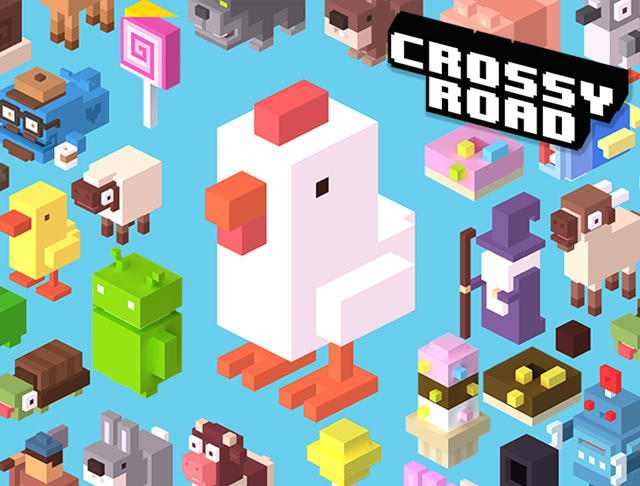
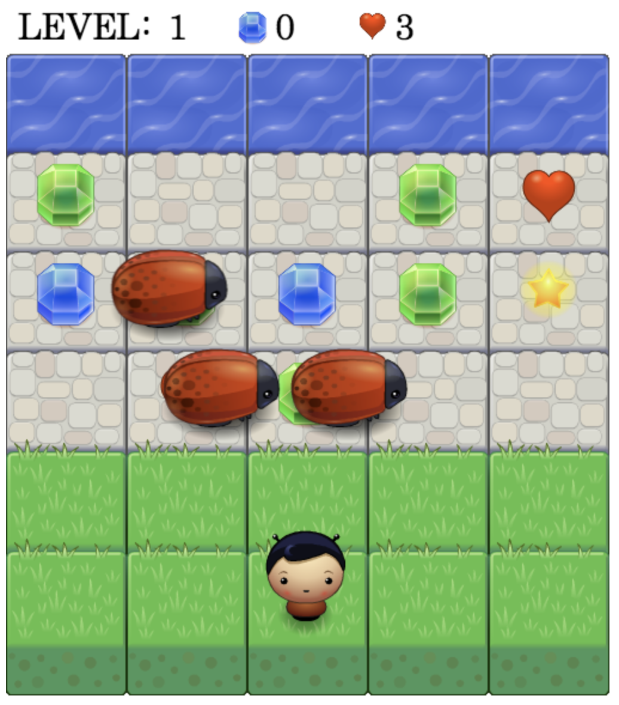
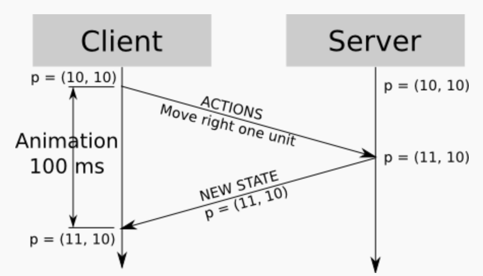
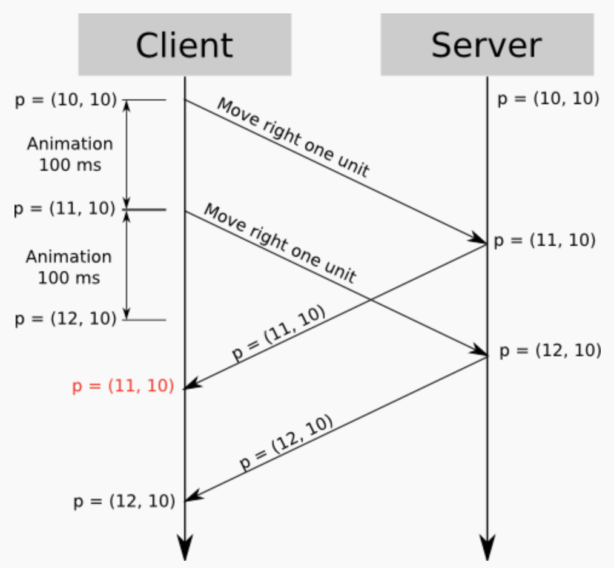
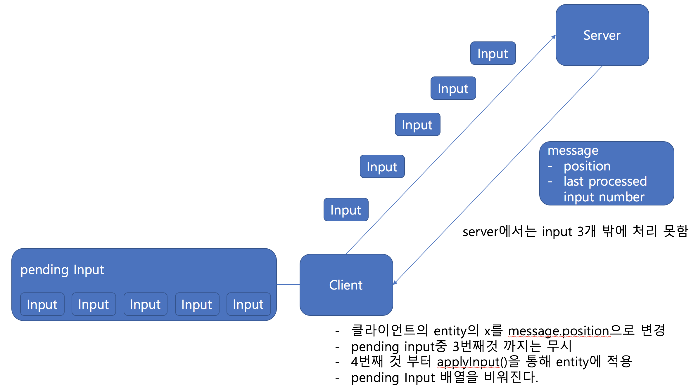
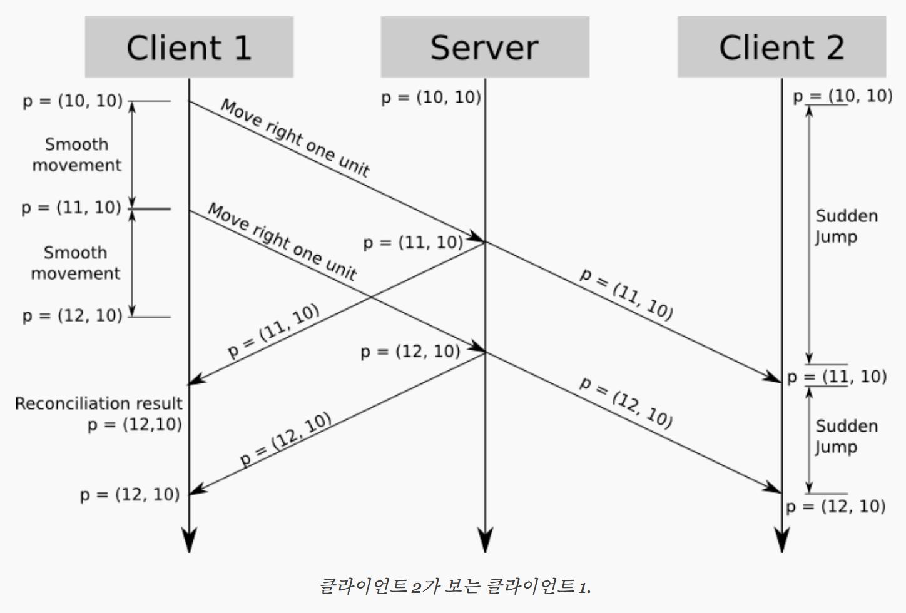
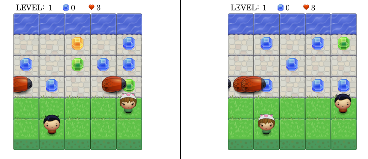
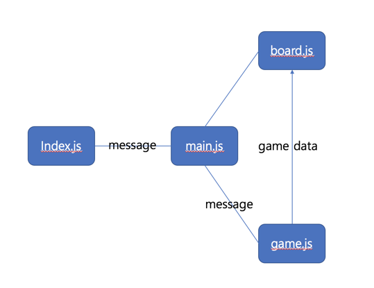
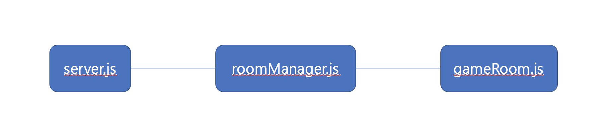

# 오픈소스로 javascript와 nodejs 익히기 part2

내가 테트리스를 완성시키고 두번째로 시도해본 게임은 길건너 친구들이다.

### 왜 길건너친구들인가?
- 그 당시에 길건너 친구들이라는 게임을 하면서 수 많은 캐릭터들을 모으는것이 재미있었다.
- 약간의 컨트롤로 큰 재미를 얻을 수 있었다.
- 테트리스를 만들어보니 아 오픈소스를 찾고 분석하고 나에게 맞게 개선시키면 어떤 게임이든 쉽게 만들 수 있겠다 라는 자신감이 생겼다.
- 기존의 길건너 친구들은 혼자서 하는 것이었다면 나는 서버를 붙여서 여러 사람이 함께 플레이하는 버전을 만들어 보고 싶었다. ( 이제는 길건너 친구들에 멀티플레이 모드가 생겼다!ㅠㅠ )

### Step1 지금까지 나와있는 오픈소스 관련 프로그램과 라이브러리를 구글 검색하고 정리하기

- crossy road로 검색한 결과
	- [유니티와 자바스크립트로 만들어진 길건너 친구들](https://github.com/tkesgar/crcc)

crossy로 검색하니까 검색 결과도 많지 않고, 내가 이해하기에는 너무 큰 소스들만 나왔다. 그래서 구글 검색을 다시 진행해본 결과 crossy road는 fogger라는 고전 게임에서 파생된 게임이라는 것을 알게되었다.

- Frogger로 검색한 결과
	- [Frogger Arcade Game](https://github.com/alexsales/frontend-nanodegree-frogger-arcade-game)
		- Frogger Arcade Game의 제일 초기버전
	- [Frogger Arcade Game Improved](https://github.com/gwens/arcade-game-clone)
		- 이 코드가 주석도 가장 많고, 가장 내가 이해하기 편했다.
		- 여러개의 캐릭터 선택이 가능하다.
		- 캐릭터가 타일 단위로 움직여서 crossy road와 동작이 비슷하다.
	- [Frogger Arcade Game less Improved](https://github.com/danceoval/frogger)
		- 두번째 버전과 비슷한데, 캐릭터가 타일 단위로 움직이지 않는다.
	- [Supermario - made by javascript and phaser](https://github.com/zakhttp/super-mario-frogger)
		- 그나마 가장 crossy road와 비슷한 느낌이다.
		- 하지만 phaser라는 게임 엔진을 익혀야 하고, UI를 따와서 쓰기엔 조금 조잡했다.
	- [Frogger Arcade with variable character version](https://github.com/eddiechou/BuggerGame)
		- 게임 시작시 캐릭터를 골라서 시작할 수 있다.
		- 그러나 stage가 넘어가도 다른 캐릭터들이 사라지지 않는다.
		- 캐릭터의 이동이 이상하다.

이렇게 비교 검색해본 결과 내가 이해하기 편하고, 개선시킬 수 있을 것 같은 코드는

-  [Frogger Arcade Game Improved](https://github.com/gwens/arcade-game-clone)

이 코드였다.

### Step2 선택한 오픈소스 분석

오픈소스를 이해하고 나아가서 개선시키기 위해선 일단 그 오픈소스의 구조가 어떻게 되어있는지 파악하는 일이 필요했다.

그래서 해당 소스를 실행시켜보고 어떻게 돌아가는지 조금 추적해본 후에 로직과 뷰 부분을 분리해서 내부 로직부터 메소드 하나하나 분석해보기 시작했다.

이 소스에서는 app.js, engine.js, resouce.js로 나뉘어져 있었다.
- app.js에서는 player 객체 enemy객체 popup객체로 나뉘어있었다.
	- enemy객체
		- initialize 메소드
			- 게임이 진행중 일 때 player 레벨에 따라 speed를 정한다.
			- x , y좌표를 정해서 위 사진처럼 어느 라인에서 벌레들이 나올지 결정한다.
		- update 메소드
			- 벌레들이 화면 끝으로 이동하면 다시 처음 위치로 보낸다. 객체를 재 생성하는 것이 아니고 처음부터 3개를 생성 해 두고 위치를 초기화하는 방식으로 한다.
		- render 메소드
			- 해당 벌레의 이미지를 x,y 값에 따라 그 위치에 그려주기위한 것이다.

이런식으로 각 객체와 engine.js, resource.js를 분석하였고 전체적인 정보 처리 과정을 파악하였다.

### Step3 분석한 오픈소스에서 개선할 부분 찾기
- 맨 처음 게임 흐름을 봤을 때 브라우저의 frame rate에 따라 계속해서 조건을 체크하고 상태를 조정하는 것이 나에게는 비효율적이고 왜 이렇게했지? 라는 생각이 들었다.
	- 그런데 벌레들이 계속해서 앞으로 움직이기 위해서, 또는 나중에 서버를 연결했을 때 서버의 응답을 받아서 체크하기 위해서는 어떤 loop을 돌아야 한다는 판단이 들었다.
	- 그리고 게임 개발 관련해서 구글링을 했을 때도 대부분은 loop 돌면서 상태체크 -> 로직 수행 -> 데이터를 기반으로 랜더링 의 과정을 거친다고 한다.

- app.js에서 player, enemy, popup 객체가 한 파일에 작성되어있었고, 전역객체로 선언되어있었다.
	- 각자의 역할에 맞게 player.js, enemy.js, popup.js 파일을 생성하고 각 객체를 모듈화 시켰다.
	- 그리고 app.js에 game 전체를 관리하는 개념으로 FroggerGame이라는 객체를 만들고 각 모듈을 가져와서 객체화 시켜서 사용하게 하였다.

- rendering은 전역 객체로 선언된 player, enemy, popup 객체의 데이터를 가져와서 실행하는 방식이었다.
	- 전역 변수, 전역 객체의 사용은 모든 프로그래밍 분야에서 꼭 필요한 것이 아니라면 권장되지 않는다.
	- 따라서 랜더링하는 모듈을 DrawFroggerGame.js로 분리하고, 그것을 FroggerGame에서 불러와서, game 관련 데이터를 넘겨주는 방식으로 랜더링을 진행하도록 하였다.

- 랜더링이 canvas로 진행되고 있었다. 내 입장에서는 canvas를 직접 다루는 것 보다는 p5.js로 다루는 것이 더 편했고 그것을 더 익히고 싶었기 때문에 rendering 방식을 p5.js를 사용하는 것으로 변경하였다.

- 전역 변수를 권장하지 않는 이유

1. 변수 범위가 너무 넓어서 이해하기 어렵다. 프로그램 여기 저기서 값을 읽거나 '변경' 가능하므로 사용처를 추적하기 어렵다.

2.  프로그램 내 변수와 함수 등 여러 요소들과 커플링이 심해진다.

3.  동시에 여러 쓰레드가 값을 변경할 수 있으므로 동기화가 필요하다.

4.  전역변수는 모든 곳에서 사용되므로, 네임 스페이스가 오염된다. 즉 어떤 메소드 내부에서만 잠깐 쓸 변수를 선언했는데, 그것이 전역 변수와 같아서 생기는 문제가 있을 수 있다.

5.  테스팅을 위한 환경을 만들기 어렵기 때문에 테스트가 어려워서 프로그램의 품질을 보장하기 어렵다.

### Step4 1인용 온라인 게임으로 만들기

원래 게임이 1인용 오프라인 게임이었고, 그것을 위해서 말한것을 바탕으로 구조를 모듈화를 통해 개선시키고 뷰를 교체하면서 1인용 오프라인 게임이 자연스럽게 완성되었다.

1인용 온라인 게임을 위한 여러가지 생각을 했다.
1. 클라이언트에서는 서버와 데이터를 소켓으로 주고받기 위한 모듈이 필요하다. - > index.js에서 서버와의 데이터 통신을 전담한다.
2. p5 객체를 생성하고 기본 세팅 ( setup 메소드와 draw메소드 세팅) 및 소켓 연결이 완료되었을 때 게임을 시작시키기위한 모듈이 필요하다. -> main.js에서 p5객체를 만들고, 일정 loop을 돌면서 FroggerGame과 DrawFroggerGame과의 데이터 교환을 전담한다.
3. main.js에서는 KeyEvent가 발생하면 그것을 FroggerGame으로 넘겨서 해당 key에대한 로직을 처리하게 한다.
4. 서버에서는 room 구조를 가진다.
- 나중에 멀티플레이를 위해서 미리 서버 구조를 이렇게 설정해 둔다.
- socket.io는 채널을 설정할 수 있는 기능이 있고, 그 채널에 접속한 클라이언트들에게만 메세지를 보낼 수 있는 기능이 있다.
- roomManager를 두고 client 추가 제거, 같은 채널의 클라이언트에게 message broadcast 기능을 전담한다.
- 소켓으로 클라언트에서 어떤 움직임에 대한 데이터가 들어오면 그 데이터를 내가 아닌 다른 클라이언트들에게만 움직임 정보를 broadcast하고 다른 클라이언트에서는 자신이 아닌 다른 사람의 동작을 받으면 그 동작 그대로 자기 화면에서 움직이는 방식이다.
- 테트리스에서 멀티플레이를 구현했던 방법과 유사하다.
- 정확히 될지 안될지는 모르지만 일단 이 방법으로 동기화한다고 생각하고 일단 구현 해 두었다.

### Step5 다인용 온라인 게임 만들기

위의 과정으로, 서버와 클라이언트가 움직임에 대한 데이터를 주고 받으며 혼자서 게임 플레이가 되도록 만들었다.

하지만 아직 멀티플레이를 구현하기에는 부족했다. 그 이유는
- 2명의 클라이언트에서 버튼을 1초에 100번씩 연타한다고 생각 해 보자.
- 이 움직임 데이터가 서버로 몰리고, 서버는 1초에 200개의 요청을 처리해서 각 클라이언트로 전달 해 주어야 한다.
- 그런데 room의 개수가 만약 1000개라고 하면, 서버는 1초에 20만개의 요청을 처리해야하고 room이 늘어나면 늘어날수록 서버의 부하는 커져만 간다.

따라서 이것을 감당하기 위한 구조가 필요했다. 서버의 안정성을 보장하면서 각 플레이간의 동기화를 위한 구조.

#### 멀티플레이 게임을 위한 이론 - [Fast-Paced Multiplayer](http://www.gabrielgambetta.com/client-side-prediction-live-demo.html)

이 홈페이지에 들어가 보면 동기화를 위한 방법의 단계별로 prediction, reconciliation, interpolation을 소개하고 있다. 그리고 그 방법들을 적용했을 경우의 시뮬레이션을 제공하고 있고, 개발자 도구를 이용해서 이것을 어떻게 구현했는지 소스코드를 살펴볼 수 있다.

나는 이기환님이 이 소스를 분석해 보는 것이 어떠냐고 추천해 주셨고, 그래서 이 소스를 오픈소스 분석했던 것과 같이 어떻게 돌아가는지 파악하고, 메소드 하나하나 분석하며, 홈페이지의 글을 읽어보며 전체적인 정보 처리 과정을 익혔다.

간단하게 이야기 해 보자.
- 우리는 각 플레이어의 움직임을 조금 더 부드럽게 동기화 하고자 한다.
- 하지만 각 플레이어의 움직임 데이터는 서버를 거쳐야 하기 때문에 일정시간 지연이 발생할 수 밖에 없다.
- 물론 로컬 환경에서 서버를 돌리고 게임을 돌린다면 지연이 없겠다.
- 하지만 만약 우리의 서버가 미국에 있고, 미국 서버까지 가는데 50ms가 걸린다고 생각 해 보자. 만약 우리의 움직임을 받아야 하는 클라이언트가 도쿄에 있다면 100,200,심지어 500ms의 시간이 걸릴 수도 있다.
- 0.5초 우리에게는 매우 작은시간일 수 있지만 게임을 하는 사람의 입장에서는 게임을 진행할 수 없을 정도로 엄청난 렉이 발생하는 것을 경험할 것이다.
- 따라서 우리는 여러 방법으로 이 문제를 해결할 방법을 모색 해 볼 것이다.

##### Prediction
- 가정
	- 플레이어가 두명 있고,
	- 그 플레이어 둘이서 서버를 통해 데이터를 주고 받으며 동기화를 하고,
	- 각 플레이어는 방향키를 움직였을 때 그 방향으로 1칸만을 움직이며,
	- 어떤 동작을 행 하기 전에 서버에 그 동작에 대한 데이터를 보내고, 그게 타당한 움직임임을 확인 받은 후(동기화 한 후) 서버의 응답에 따라 움직인다.

- 위의 가정과 같은 상황에서 플레이어를 1칸 움직인다고 해보자.
	- 서버까지 데이터가 오기 전까지 우리는 100ms가 걸린다고 가정하면 0.1초동안 플레이어는 아무것도 못하고 기다려야 한다.
	- 하지만 우리는 어떤 방향키를 눌렀을때 그 방향으로 1칸 움직인다는 것은 결정론적인 것이고 예측 가능한 상황이다.
	- 따라서 우리는 서버에 요청을 보냄과 동시에 클라이언트에서 임의적으로 애니매이션을 실행시켜서 '서버의 응답에 따른 움직임' 인 것 처럼 동작하게 해도 아무런 문제가 되지 않는다.

하지만 이와같은 동작도 연속된 2개의 입력이 온다면 문제가 된다. 다음의 그림을 살펴보자.

- 두번의 입력이 클라이언트에서 발생하였다.
- 그리고 클라이언트에서는 지연시간 없이 두 입력이 빠르게 처리되어 이미 (12,10)으로 이동 되어 있다.
- 하지만 서버에서는 1개의 입력만이 처리되었고 아직 2번째 입력이 도달하지 못했다. 즉 서버에서는 1칸만 이동했다는 응답이 오는 것이다.
- 클라이언트에서는 서버의 응답을 받고, 동기화를 위해 1칸 뒤로 이동하게 된다.
- 그리고 다시 두번째 입력에 대한 응답이 왔을 때 두번째 입력으로 이동한다.

즉 예측해서 움직였지만 결국 서버와의 동기화 때문에 뒤로 한칸 이동했다가 다시 와야하는 일이 발생하였다.

##### Reconciliation
Prediction의 상황을 해결하기 위한 방법이다.

만약 클라이언트가 2개의 입력을 이미 처리했는데 서버에서는 1개의 입력만이 처리되었다고 하자.

- 클라이언트는 입력이 발생하면 그 입력을 일단 자신이 저장하고 있다.
- 그리고 서버에서는 클라이언트의 데이터를 처리한 내용과 함께 어떤 입력들이 처리되어서 이 결과가 나왔는지에 대한 배열을 같이 클라이언트로 보내준다.
- 클라이언트에서는 서버에서 준 배열과 자신이 처리한 입력 배열을 비교하며 이미 처리한 내용인지 아닌지를 판단하고 이미 처리된 입력이면 중복해서 플레이어에 적용하지 않고 동기화 되었다는 체크만 하고 무시 해버린다.
- 이렇게 함으로써 클라이언트는 움직임이 rollback 되지 않는 부드러운 움직임을 볼 수 있고, 서버와의 동기화도 챙길 수 있다.

##### Interpolation

이 방법은 플레이어가 a에서 b로 이동할 때 한번에 워프하듯 이동하는 것이 아닌, 이동 history가 어떻게 될지를 보간법을 통해 계산하는 방법이다.

내가 만드려는 게임은 연속적인 움직임이 아닌, 타일을 기반으로 한칸 한칸 움직이면 되는 게임이라서 보간법까지는 적용하지 않았다.

----------

이렇게 세 이론을 파악하고 소스코드를 분석해 보니 멀티플레이를 어떻게 구현할 지 감이 왔다. 그리고 그것을 코드로 옮겨냈다.
- 클라이언트에서는 input이 발생하면 일단 처리하고,  서버로 메세지에 input을 담아서 전송한다.
- 서버에서는 message들이 들어오는대로 messageList에 담아두었다가 0.3초 또는 더 긴 간격마다 message에 들어있는 input에 대한 처리를 진행한다.
- 서버에서 input 처리가 끝나면 자신이 처리한 inputList와 해당 플레이어의 최종 이동 위치를 각 클라이언트에 전송한다.
- 각 클라이언트는 처리된 인풋을 받아서, 이미 처리된 데이터이면(input을 만든 장본인) 동기화 체크만 하고 무시하고, 처리되지 않은 데이터면(input을 만든 플레이어가 아닌 다른 플레이어) input에 따라 똑같이 움직이도록 해서 최종 이동 위치와 비교한다(for 타당성 체크)
- 다른 플레이어의 움직임을 재현할 때 inputList 데이터를 하나하나 반영시키면서 워프하는 것이 아닌 한칸씩 움직이도록 한다.

이렇게 게임을 진행시키면 클라이언트에서 아무리 많은 데이터가 발생해도 서버에서는 0.3초마다 데이터를 처리하기 때문에 서버가 감당하는 부하가 줄어들고, 각 플레이어의 움직임도 부드럽게 이동하는 것을 어느정도 보장할 수 있다.

아직 원활한 플레이를 위해서는 더 해결해야할 문제가 있지만 개인 프로젝트라서 이정도에서 마무리 지었다.

[Frogger-game source code](https://github.com/wonjerry/frogger-server-client)

##### 클라이언트 구조

##### 서버 구조

- 클라이언트가 접속하면 server.js에서 연결요청을 받고 RoomManager에 socket객체를 넘긴다.
- roomManager에서는 클라이언트를 적절한 room에 배정한다.
- gameRoom에서는 fase-paced 이론에 따라서 0.3초마다 데이터를 받고 처리해서 다른 플레이어들에게 전송하는 기능을 한다.

##### 이 프로젝트로 배운점

1. 아무리 작은 프로그램이라도 눈에 보이는 것보다 어렵다.
2. 게임 상태를 공유하고 그것을 여러사람이 플레이하려면 단순히 데이터를 전달하는 것이 아니라 서버는 어떤 부하를 견뎌야 하고, 부드러운 움직임을 위해서는 어떤 고려를 해야하는지를 배웠다.
3. 어떤 이론을 이해하고 그 이론을 코드로 표현 해 냈다.
4. 내가 무언가를 만들기 위해서 밟아야할 step을 작은 게임으로 나누었고 그것들을 해결하면서 하나를 완성하였다.

이 프로젝트를 하면서 들었던 생각이, 나는 학교 다닐때 콘솔로만 프로그래밍을 하다보니까 객체화 모듈화 이벤트화 등등의 개념이 크게 와닿지 않았다. 그냥 쭉 이어서 만들어도 돌아갔으니까.

하지만 뷰를 만들어보고 그것을 로직과 연결하는 경험을 하니 어떻게하면 뷰와 로직을 더 분리할지, 로직의 데이터를 뷰에 효과적으로 전달할지 뷰에서 이벤트가 발생하였을 때 이것을 어떻게 로직으로 전달할지 등의 고민을 함에 따라서 위의 개념들이 필요함을 느꼈다.

그리고 서버까지 연결하면서 어떻게하면 서버와의 통신을 효율적으로 할지, 통신하는 부분과 뷰 로직을 어떻게 나눌지를 고민하다보니 그것을 자연스럽게 고민하게 되었다.

모든 이론이 나온 것에는 이유가 있다. 다 개발을 하면서 했던 고민들의 산출물이며, 그것들을 단순히 받아들이기보다는 이런 작은 게임이라도 만들면서 그것을 직접 느껴봐서 좋았다는 느낌이 든다. 그리고 이런 작은 시도들이 나중에 더 큰것을 하게 해줄 것이다.