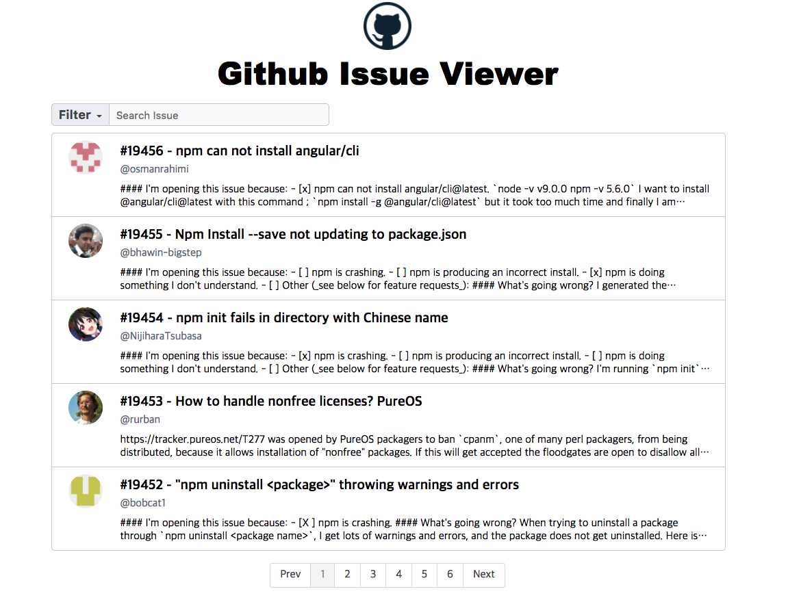

## Github Issue Viewer refactoring to Backbone

저번에 그냥 vanilla로 gihub issue viewer를 만들었었다. 내가 웹 프론트에 관심을 가지게 된 이유들중 하나는 사람들이 react, angular, backbone에 관심을 가지고, 많이 사용하며 트렌드가 이리저리 바뀌는데 그것들을 왜 사용하는 것일까? 각각의 장점은 뭐고 내가 직접 그 장점들 또는 단점들을 느껴보고 싶다 였다.

같은류의 프로그램을 vanilla js로 만들어 보고, 각각의 프레임워크로 만들어 본다면 차이점을 느낄 수 있지 않을까? 라는 생각에서 일단 backbone으로 먼저 리펙토링을 진행 해봤다.

맨 처음에는 backbone이라는 프레임워크가 MVC 구조 구현하고 있는 줄 알았다. 하지만 documentation을 보니 달랐다. backbone은 기본적으로 MV 구조를 구현하고 있다. view와 model이 상호작용 하면서 이벤트를 받아서 데이터를 변경하고 그것을 다시 보여주는 일을 한다. 그리고 Collection이라는 것도 존재하는데 이것은 model들의 집합이며, model을 관리하기 위한 여러가지 메소드들을 가지고 있다.

MV 구조를 제공함으로써 backbone은 UI와 data 의 sync를 맞추게 도와주는 역할을 한다.

맨 처음에 MVC로 구현했기 때문에 Controller에 존재하던 메인 로직이 어디에 있어야 할지 데이터를 어떻게 주고받아야 하는지에 대해 약간 혼란이 왔다. MVC 구조에서 M과V는 단순히 데이터 저장 변경 제공, 이벤트 등록 데이터 보여주기 역할을 했기 때문이다.

나는 이 부분에 대해서 조금 고민을 하다가 이전에 구현했던 react의 구조를 조금 따져봤다. react는 V에대한 라이브러리이지만 data를 다루기 위해서는 (redux를 제외하고) 각 컴포넌트에 state를 저장하고, 그 state를 변경하는 메소드를 가지며 그것을 하위 컴포넌트로 넘겨주는 행위를 하면서 어떤 이벤트가 들어왔을 때 데이터 변경 및 re-rendering을 처리했다.

이와 같은 방식으로, issue와 commnet에 대한 collection 및 model을 만들어서 데이터를 관리하게 하고, 각 부분을 컴포넌트화 하고, 각 컴포넌트에 맞는 View를 만들어서 각 부분에서 발생하는 이벤트에 따라 각 부분의 데이터를 변경하고 re-rendering 하도록 하였다.

예를들어 issue라는 model이 있고, issueList라는 collection이 있으며, issueListView라는 view가 있고 issueView 라는 하나의 issue model에만 집중하는 view가 있다고 하자. 
- 일단 issueListView의 collection으로 issueListCollection 객체를 넘겨준다.
- collection에는 issue model들의 array가 있다.
- issueListView는 filtering이나 searching 메소드를 가진다.
- 만약 mainView 내부에서 filtering 이벤트가 발생하면 filtering 메소드를 실행시킨다.
- filltering 메소드가 실행되면 데이터가 변경되고 collection 내부의 modifiedList 프로퍼티가 변경되며 filtering이벤트가 trigger 된다.
- mainView 에서는 filtering 이벤트가 트리거 되면 collection의 modifiedList를 기반으로 rendering을 다시합니다.

### 접근 방법
기존의 Controller 부분을 제거했습니다.
- 라우터가 존재합니다.
	- '' 루트에서는 AppView를 생성하고 Appview에서 MainView를 생성하도록 합니다.
	- '/issueDetail/:id' 루트에서는 MainView를 숨기고, id에 맞는 issue를 DetailView가 그리도록 합니다.
	- 만약 '' 루트에 접근했을 때 appview 인스턴스가 없다면 새로 생성하며, 이미 있다면 그냥 랜더링만 진행합니다.
	- 만약 '/issueDetail/:id'에 접근했을 때 appview 인스턴스가 없다면 ''루트로 redirectiong하며 데이터를 appview 인스턴스를 생성하고 MainView를 랜더링 하도록 합니다.
- Appview에서 MainView와 DetailView를 가지고 있습니다.
- MainView에서는 SubnavView와 PaginationView, IssueListView를 가지고 있습니다.
	- SubnavView에서 filtering, searching이벤트가 발생하거나 Pagination에서 change 이벤트가 발생한다면 IssueListCollection 내부의 models array에 대해서 각 이벤트를 처리하고 modifiedList를 업데이트 하며, 각 이벤트를 trigger 합니다.
	- mainView에서는 해당 이벤트를 catch하면 re-rendering을 합니다.
	- 각 뷰는 데이터에 맞게 다시그려집니다.
- DetailView에서는 클릭된 issue에 대한 detail한 내용을 보여줍니다.
	- 일단 issueListCollection에서 issue 데이터를 찾아서 rendering 하고, 해당 issue가 comment를 가지고 있다면 commentCollection을 통해 서버에서 데이터를 fetch 하고 데이터가 성공적으로 도착하면 rendering 합니다.

기존에 있던 기능에 대해서는 이전에 vanilla js버전에서 했던 방식과 거의 동일하게 접근했으므로 기능에 대한 설명은 하지 않겠습니다.

### 어려웠던 점, 좋았던 점

1. 맨 처음에 썼듯, MVC구조에서 MV 구조로 넘어가려니 혼란이 왔습니다.
	- react 구조를 생각 해 보고, 각 뷰를 컴포넌트화 하고 각 컴포넌트가 필요한 model에 연결시켜서 로직이 진행되도록 했습니다.
	- vanilla js로 했을 때 보다 조금 더 정돈되고, 각각 어떤 데이터를 다루고, 어떤 기능을 하는지가 분리된다는 점이 좋았습니다.
2. 사실 backbone은 컴포넌트 방식으로 할 수도 있었지만 프로그래머에 따라 다양한 구조로 만들 수 있다는 생각을 했습니다.
	- 컴포넌트 방식이 아닌 더 좋은 방식으로 개선시키고 더 다양한 구조가 있을 수 있다는 점이 좋았습니다.
	- 하지만 프로그래머가 제대로 못한다면 더 안좋은 성능을 낼 수도 있고, 그에따라 개발이 늦어질 수 있겠다는 생각을 했습니다.
	- react와 비교해 보면 react는 그들이 제공하는 고정적인 방식으로 데이터를 주고 받아야만 하지만 backbone은 조금 더 자유롭다고 느꼈습니다. 

3. 좀 더 큰 프로젝트라면 Controller가 필요하겠다 라는 생각을 했습니다.
- 컴포넌트 방식이 아닌 MVC 방식으로 할것이라면 사용자가 직접 C를 구현하고 효율적인 동작을 할 수 있겠다는 생각을 했습니다.
- 그런데 이렇게 되면 프로그래머가 할게 많아지고, 개발이 급하거나 프로그래머의 역량이 부족한 경우에는 생산성이 낮아지겠구나 생각했습니다.

4. jquery와 underscore에 대한 디펜던시가 마음에 안들었습니다.
- jquery를 선호하는 편도 아니고, underscore보다 더 좋은 template가 있는데 이것에 대한 디펜던시 때문에 여러개를 더 설치하고 사용해야 한다는 점이 마음에 안들었습니다.
- template engine은 굳이 다른것을 쓰려면 쓸 수 있겠지만 뭔가 프로그램이 무거워지는 느낌을 받았습니다.

### 이 프로젝트를 하면서 배운점

- 이렇게 자유로운 방식의 프레임워크도 있구나 생각했다.
- 뭔가 react를 많이 사용하다 보니, 자유로운 프레임워크를 사용하더라도 뭔가 그 방향으로 흘러가는구나 라는 생각이 들었다.
- 확실히 framework를 쓰면 생산성은 확 느는 것 같다. 처음 러닝 커브가 없었다면 그냥 몇시간 만에 컨버팅이 가능했을 것이다.