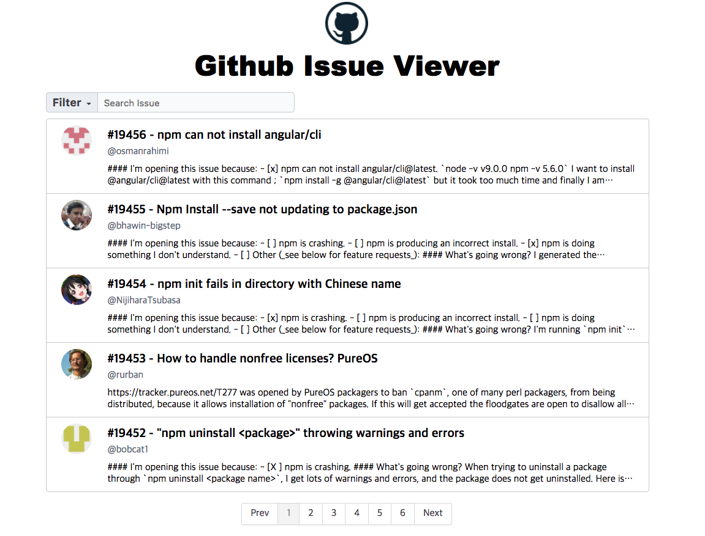

## Github Issue Viewer 개발기

요새 front-end 쪽을 공부하면서 사이드 프로젝트를 뭔가 하고 싶다는 생각이 들었다. 그래서 살펴보다가 원래 만들어보려던 아이디어가 있었는데 그 전에 어떤 회사의 면접문제라고 하면서 ken님이 이걸 만들어 보면 어떻겠냐는 제안을 했다.

원래 하려던 것은 github의 commit log를 가져와서 달력에 띄우고 기타 부가기능을 만드는 것이었는데 이것도 내가 원래 하려는 것과 비슷한 것을 필요로 했다. github api를 사용 해 봐야 하고, 그 데이터를 가져다가 가공해서 그려줘야 하고 필터링 및 searching도 필요했다.

맨처음에 딱 과제만 보고나서는 '아 이거 데이터만 받아와서 리스트띄우고 타이틀 누르면 상세페이지로 이동시키면 되겠다' 라는 생각이 들었다. 그리고 요새 사용하려고 하는 react를 활용해서 이것저것 붙여서 해보려고 했다.

그런데 면접문제이다보니 이 문제를 해결하기 위해서 어떤 기술 스택을 사용했고 그 기술 스택을 왜 사용했는지를 생각해서 설명해야 했다. 그리고 생각했다 내가 왜 react를 쓸까? 과연 react가 필요할까?

맨 처음에 react를 사용해보겠다고 생각 한 것은 filtering과 pagination 등등 에서 이벤트가 발생하면 list를 조정해야 하는 일이 있었다. 나는 다른 영역에서 또 다른 영역에 접근해서 데이터를 조작하는 것은 별로라고 생각했고 그것을 조금 더 효율적으로 했으면 좋겠다고 생각해서 react를 떠올렸었다.

그러나 react 는 이벤트를 넘겨주고 받고 state를 관리하고 하면 꽤나 복잡해 지고 이것들을 좀 더 효율적으로 하기 위해서는 redux를 사용하는 편이 좋은데 이렇게까지 하면 과제에 비해 너무 무거워지는 단점이 있었다.

그런데 이 문제는 MVC 패턴만으로 어느정도 커버가 되는 내용이다. M에서 데이터를 관리하고 V에서는 이벤트 등록, 데이터 받아오고 보여주는 일을 하고 controller 에서는 이것들을 조합해서 필요한 기능을 만들어 내면 되었다.

그래서 대략적인 화면의 구동 방식을 먼저 떠올려 보고 코딩에 들어갔다.

### 접근 방법

맨 처음에 페이지 수는 2개로 정했습니다. 메인 페이지는 api로 받아온 issue list를 띄우고 검색, 필터링, 페이지네이션을 구현하고 타이틀을 누르면 상세페이지로 이동합니다.

메인 페이지에서는 리스트를 한 페이지당 5개씩 보여주고 페이지 번호를 매겨야 한다. 따라서 api로 받은 리스트에서 현재 보여질 부분만 랜더링 하면 된다. 그리고 만약 필터링이나 서칭이 이루어진다면 필터링 된 리스트에서 5개씩을 보여줘야 한다. 즉 리스트에 대한 어떤 조작(검색 또는 필터링)이 있다면 항상 페이지네이션을 거쳐야 한다.

detail 페이지에서는 저장해둔 issue list에서 해당 issue number에 해당하는 issue를 찾고 먼저 랜더링 한 후, comment가 있으면 network를 통해 받은 후 rendering 한다.

- #### Main page
	- packet list가 들어오면 그것들 중 나에게 필요한 데이터만 뽑아서 가공한다. 그 후 list를 저장 해 둡니다.
	-  처음에 list가 들어오면 초기에 지정해 둔 showlistnum 즉 한 페이지에 보이는 리스트의 개수만큼 list에서 데이터를 잘라와서 화면에 그려줍니다.
	-  그리고 pagenation 이벤트를 등록해서 각 페이지마다 showlistnum 만큼 리스트를 보여줍니다.

- #### Pagenation
	- list의 길이와 showlistnum을 인자값으로 받습니다.
	- 몫의 크기 또는 나머지가 있다면 몫 + 1 만큼을 page의 개수로 계산합니다.
	- pages 배열을 만들고 각 원소에는 pagenum과 isactive 프로퍼티를 가지는 객체가 들어갑니다.
	- page 개수만큼 pagenation bar를 rendering 합니다.
	- 각 페이지 버튼을 누르면 list에서 어느부분을 보여줘야 하는지를 연산해서 list를 바꿔줍니다.
	- prev, next를 누르면 전 , 후 페이지로 이동합니다.

- #### Searching
	- input에 keyup 이벤트를 등록 해 둡니다.
	- 이벤트가 발생 할 때마다 value를 받아옵니다.
	- 이전에 등록해 준 list를 순회하며 title 또는 issue number와 같은지를 체크해서 일치하는 원소들을 모아 배열로 리턴 해 줍니다.
	- 초기에 지정해 둔 showlistnum 즉 한 페이지에 보이는 리스트의 개수만큼 list에서 데이터를 잘라와서 화면에 그려줍니다.
	-  그리고 pagenation 이벤트를 등록해서 각 페이지마다 showlistnum 만큼 리스트를 보여줍니다.

- #### Filtering
	- filter 버튼을 hover 하면 all, open, close menu가 나옵니다.
	- 각 버튼을 누르면 저장해둔 list를 순회하며 state 가 일치하는 원소를 찾아서 배열로 만들어 리턴해줍니다.
	- 초기에 지정해 둔 showlistnum 즉 한 페이지에 보이는 리스트의 개수만큼 list에서 데이터를 잘라와서 화면에 그려줍니다.
	-  그리고 pagenation 이벤트를 등록해서 각 페이지마다 showlistnum 만큼 리스트를 보여줍니다.
	-  이때 만약 filering 후 search 하면 filtering 한 list에 대해서 search를 진행합니다.

- #### detail page
	- list element에서 title을 클릭하면 a태그에 등록된 #path로 이동합니다.
	- content 내부의 mainView, footer를 숨기고 detailView를 띄웁니다.
	- issue list에서 issue number에 해당하는 원소를 가져옵니다.
	- body를 markdown parser로 랜더링 해서 해당 issue의 본문을 그려줍니다.
	- 만약 comment가 있다면 api요청을 통해 데이터를 받아서 issue 본문 아래쪽에 랜더링 해 줍니다.

- #### routing
	- pushState가 아닌 hash로 구현 했습니다.
	- a 태그를 클릭하면 #path가 현재 url에 추가됩니다.
	- window 객체의 onHashChange 이벤트를 감지해서 path에 따라 상세페이지를 보여주거나 메인 페이지를 보여주도록 했습니다.

### 어려웠던 점

1. 맨 처음에는 MVC 패턴을 고정적으로 생각 해 두고 각각의 역할을 정의한 다음 이어 붙여서 기능을 완성시켜보려고 했는데 생각보다 연결이 쉽지 않았습니다.
-	일단 먼저 한 js 파일에 모든 기능을 하드코딩 해서 돌아가도록 해 보았습니다.
-	거기서 뷰, 컨트롤러, 모델을 나누고 반복되는 부분을 묶어가면서 MVC 패턴을 적용시켰습니다.
-	이 과정을 해 보면서 추상화나 캡슐화 개념에 대한 느낌이 와서 좋았다.

2. filtering, searching 을 직접 구현해본적이 없어서 라이브러리를 사용해보려고 했습니다.
-	켄님과 얘기 해보고 직접 구현하봤는데 array 객체의 filter 기능을 사용하니 쉽게 구현이 가능 했습니다.

3. pagenation을 구현 해본적이 없어서 어떤 식으로 만들어야 할지 잘 몰랐습니다.
- 일단 codepen에서 다른사람들의 pagenation코드을 먼저 분석 해 봤습니다.
- 대부분 내부적으로 list를 저장 해 두고 indexing을 통해 list element를 빼와서 그것만 다시 랜더링 하는 방식으로 하고 있어서 그대로 적용 해 봤습니다.

4. 라우팅 구현 시 뒤로가기 하면 원래 페이지로 돌아가고 싶은데 잘 안됐습니다.
- pushState와 hashChange 방식을 리서치 해 보고 어느 방식이 이 프로젝트에 적절한지 판단한 후 적용시켰습니다.

### 기술 스택

1. Mustache
- 템플릿 엔진입니다.
- 이 프로젝트에서 가장 많이 하는 일이 가공된 데이터를 dom에 rendering 하는 것이었습니다.
- createElement를 사용해서 생성하고 이벤트를 등록할 수도 있었지만 그것 보다 mustache를 사용하는 편이 가독성 면에서 좋았습니다.
- 코드 상에서 코드의 양이 줄어들었고, template.js에 template 를 string 형태로 등록 해 두고 사용하면 어떤 뷰에서 어떤 데이터를 사용해서 rendering 하는지 한눈에 파악하기 편했습니다.
2. Request.js
- jquery를 사용해서 ajax를 쓸 수도 있었습니다.
- 하지만 jquery를 로딩해서 ajax만 사용하기에는 너무 jquery가 무거웠습니다.
- request 모듈을 사용하면 ajax보다 가독성 면에서도 좋고 덜 무겁기 때문에 이것을 사용했습니다.
3. Remarkable.js
- [벤치마크 테스트](https://jsperf.com/showdown-js-vs-marked/19)
- 마크다운 parser 중 remarkable.js 가 제일 빨랐습니다.
- \n, \r 과 같은 것들을 br로 변환 해 주는 등 필요한 기능이 다 있었습니다.

- [remakable.js live demo](http://jonschlinkert.github.io/remarkable/demo/)
		- 데모도 있어서 실제 어떻게 돌아가는지 볼 수 있어 편했습니다.

- 벤치마크 테스트 목록에 있는 다른 것과 비교해 봤을 때 이 라이브러리가 가장 빠르고, 내가 필요한 기능을 제공하고, 사용법을 습득하고 테스트하기에 좋아서 이것을 사용하였습니다.
4. Browserify
	- webpack 보다 다양한 기능을 제공하지는 않지만 덜 무겁기 때문에 단순히 브라우저에서 돌아가는 코드를 생성하기 위해서는 이것을 사용하는 것이 적절하다고 생각했습니다.
5. Jasmine
- mocha와 기능은 거의 비슷합니다.
- mocha는 spyon과 같은 기능들을 따로 sinon 라이브러리를 적용해서 처리해야 하는데 jasmine은 그럴 필요가 없기 기본 내장이라 이것이 적적하다고 생각했습니다.

### 이 프로젝트를 하면서 배운점

- MVC 패턴에 대한 이해도를 높였고 직접 구현했다.
- Controller의 메소드들을 구현하면서 oop의 추상화 캡슐화에 대한 이해도가 높아졌다. 감이왔다.
- 어떤 프로젝트를 하면서 어떤 기술 스택을 사용할 때 이 프로젝트에 적합한지, 같은 종류의 기술스택중 어떤 것이 더 나은지 비교하는 것
- 라우팅 방법들
- 처음부터 패턴을 적용해서 코딩할 수는 없을수도 있다. 가끔은 하드코딩으로 구현하고 그 구조에서 필요한 패턴을 적용해 볼 수도 있다. 처음부터 완벽할 수는 없다.
- 테스팅은 노가다여서 귀찮긴 했지만 나름 하면서 코드가 리펙토링 되고 예외처리도 더 하게 되었다.
- 자바스크립트에서 상속을 구현하고 프로토타입 체인을 통해서 공통적인 기능은 부모에 있는 메소드를 끌어쓰도록 했더니 코드의 중복이 줄었다.
- 디테일에 대한 것을 뼈져리게 느꼈다. 이렇게 작은 프로젝트에서도 디테일이 중요하다 ㅠㅠㅠ 코드를 리뷰하는 사람을 위한 배려, 가독성, 나만의 CODING STANDARDS가 필요하다. 프로젝트가 커지면 커질수록 이런 작은 디테일이 없으면 가독성에 심각한 문제가 생기기때문에 지금부터라도 스스로 기준을 정해서 하고, 회사에 들어가면 회사의 스타일을 따라야겠다.
