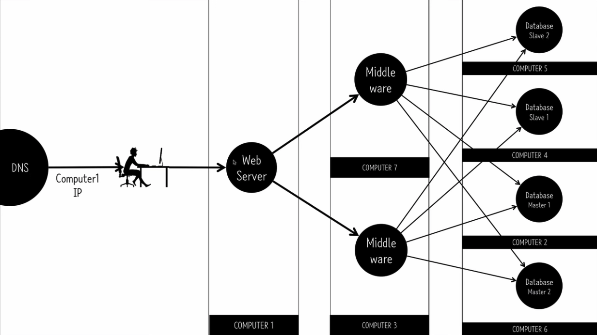
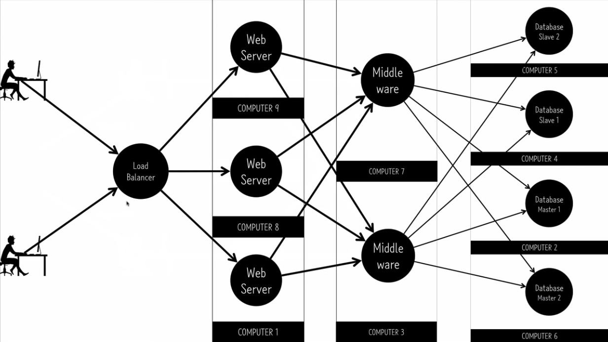

### Scale out
여러개의 서버를 사용해서 어떤 서비스를 처리하는 것이다.

여러대의 서버를 이용하다보면 복잡도가 매우 올라가기 때문에 진짜 필요한 상황이 아니라면 scale up으로 처리하는 것이 더 낫다.

어떤 서버가 한대의 컴퓨터로 구성되어있다고 해 보자.

일반적인 서버는 세가지의 소프트웨어가 설치되어있다.
- webserver
	- 사용자가 브라우저에서 보내는 요청을 받은후 어떤 결과값을 다시 사용자에게 전송한다.
- Database
	- 어떤 데이터를 꺼내거나 저장한다.
- Middle ware
	- 웹서버가 어떻게 동작할지를 가지고 있는 로지컬한 소프트웨어이다
	- nodejs, django, RoR ...

그런데 만약 우리의 서버의 cpu가 90%에 육박하거나 간간이 일정 시간때에 cpu 점유율이 높아진다면 일단 우리가 먼저 생각해야 할 것은 scale up이다.

그러나 scale up만으로 해결되지 않는 한계점이 오고, 이때 사용해야 할 개념이 scale out이다.

만약 webserver -> Middleware -> Database가 같은 컴퓨터에서 다 이루어졌다고 하면 scale out을 통해서 computer1에는 webserver와 middleware가 존재하고, computer2에는 database를 설치함으로써 요청이 들어오면 Database 처리는 같은 컴퓨터에서 하는 것이 아니라 다른 컴퓨터의 IP를 통해 요청을 보내고, data 처리는 다른 컴퓨터에서 처리하게 되는 것이다. 그리고 결과값을 다시 middleware에 전달되고 webserver는 사용자에게 결과를 리턴한다.

그런데 만약 middleware도 엄청난 컴퓨팅 파워를 쓰고 있다면 webserver, middleware, database를 각각 다른 컴퓨터에 구성하게 하여 세대의 컴퓨터가 요청과 응답을 주고받으며 처리하게 된다.

그런데 또 데이터베이스가 설치되어있는 컴퓨터가 점점 느려진다고 해 보자. 그러면 또 성능 향상을 위해 다른 컴퓨터를 준비하고, database master, database slave를 구성하고, master는 쓰기, slave는 읽기를 맡도록 하고, master는 빠른속도로 쓰여진 데이터를 slave에 복제함으로써 항상 데이터가 같도록 유지 해 주는 것이다.

이렇게 하면 쓰기 읽기의 역할이 분담되므로 더 나은 성능을 꾀할 수 있다.

그런데 이렇게 해도 또 느리다면 computer를 추가해서 slave를 하나 더 늘리거나 master를 늘려서 1~1000은 master1에 저장하고 2000~3000은 master2에 저장하는 방법도 있겠다.

이렇게 사용자가 많아져도 데이터베이스쪽은 이렇게 처리할 수 있겠다.

Middleware에서도 이러한 성능 이슈가 있다면 또 컴퓨터를 추가해서 두대의 컴퓨터가 같은 middleware 소프트웨어를 설치하고 있고 요청을 나눠서 처리한다.

그런데 webserver는?? webserver는 하나의 IP로 요청을 받아서 어느 middleware로 보낼지를 결정하게 되는데 webserver가 여러개가 된다면 클라이언트들은 하나의 IP로 접속할 수 없게된다.

예를들어보자. 사용자는 어떤 사이트에 접속할 때 도메인을 입력해서 접근하게 된다. 그런데 내부적으로는 DNS를 통해 IP를 찾아서 IP로 서버에 접근하게 된다. 일종의 전화번호부라고 할 수 있다.

webserver를 분산하기 위해서는 어떤 사용자가 DNS를 통해 접근할 때 어떨때는 computer1의 IP를 알려주고, 어떨때는 computer8의 IP를 알려주게 해서 처리하게 하는 것이다.

이것을 다른 방법으로 처리한다면, load balancer를 통해서 사용자가 접근했을 때 부하가 골고루 분산되도록 각 사용자를 다른 webserver로 연결시켜주는 것이다.

그럼 어떤 도메인은 loadbalancer의 IP를 가리키게 되고, loadbalancer는 단순히 벨런싱만 해주는 역할을 하게 된다.

이런 Loadbalancer를 aws에는 ELB(elastic load balancer)라고 한다.